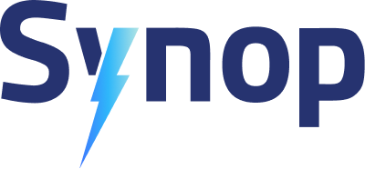

  

Synop helps fleets of all sizes transition to and manage electric vehicles with confidence. Our cloud-based platform brings together real-time vehicle data, smart charging insights, and alerting tools into a single pane of glass — helping fleet operators streamline operations, reduce costs, and meet sustainability goals.

## What We Do

Synop connects to your vehicles via leading telematics providers like Geotab, Samsara, Zonar, and Lightning eMotors:contentReference[oaicite:0]{index=0}. With these integrations, we provide:

- **Vehicle Management**: Monitor vehicle health, charging sessions, and trip history in one place:contentReference[oaicite:1]{index=1}:contentReference[oaicite:2]{index=2}.
- **Smart Charging**: Match charging sessions with vehicles and visualize energy use — even when added manually:contentReference[oaicite:3]{index=3}.
- **Alerting and Notifications**: Set up rule-based alerts to stay ahead of issues with vehicles or chargers:contentReference[oaicite:4]{index=4}:contentReference[oaicite:5]{index=5}.
- **Role-Based Access and Org Structure**: Manage complex fleets using parent/child organizations and custom user roles:contentReference[oaicite:6]{index=6}:contentReference[oaicite:7]{index=7}.

## Who It's For

Synop is built for fleet managers, energy teams, and anyone navigating the challenges of EV fleet operations — whether you're onboarding your first EV or managing dozens across locations.

## Learn More

This repository serves as a public presence on GitHub and a starting point for future open-source or community projects. To learn more about Synop, visit [https://synop.ai](https://synop.ai) or contact us at [support@synop.ai](mailto:support@synop.ai).
